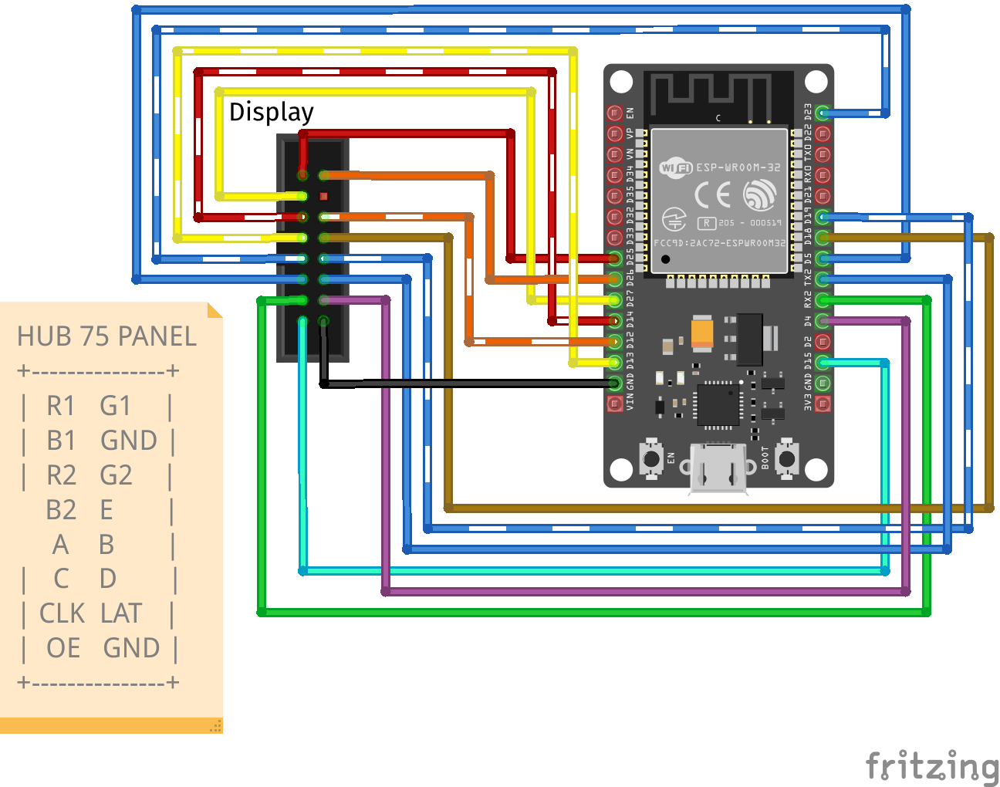
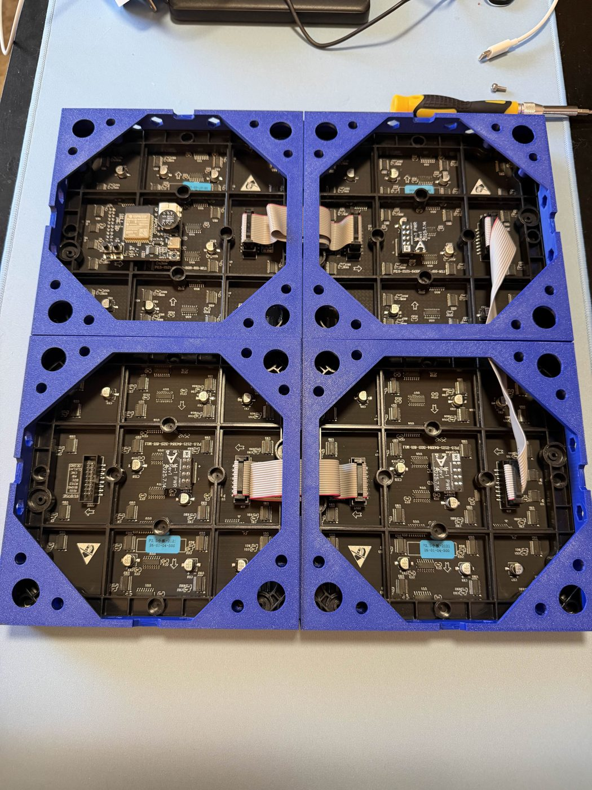

WLED supports LED matrix panels using the HUB75 format. HUB75 support was added as an official mainline feature in **v16.0.0**, and dedicated `_HUB75` build variants are included in the standard release downloads.

!!! tip "Use v16.0.1 or Newer"
    16.0.1 landed a number of HUB75 fixes, including bug fixes for 4-scan and chained (multi-panel) panels, removal of the 64x64 limit on boards with PSRAM, and a fix for updating the pixel buffer after a matrix dimension change.

This support is supplied by the [ESP32-HUB75-MatrixPanel-DMA](https://github.com/mrcodetastic/ESP32-HUB75-MatrixPanel-DMA?tab=readme-ov-file) library; see there for more details about supported hardware panels.

## Supported Boards and Builds

You can use a regular ESP32 with a HUB75 adapter board, or a board with HUB75 output built in. Flash the matching build below. If you do not see HUB75 in the list of LED types after flashing, you are not on a HUB75 build.

| Board | Firmware to flash | Notes |
|---|---|---|
| [Adafruit Matrix Portal S3](https://www.adafruit.com/product/5778) | `ESP32-S3_Adafruit_Matrixportal.bin` | Pins pre-configured for HUB75 |
| [Huidu HD-WF2](https://www.hdwell.com/Product/index46.html) (ESP32-S3) | `ESP32-S3_HD-WF2.bin` | No PSRAM. Upload via USB-A to USB-A while holding the button ([details](https://github.com/mrcodetastic/ESP32-HUB75-MatrixPanel-DMA/issues/433)) |
| [MoonHub75](https://github.com/MoonModules/Hardware/tree/main/MOONHUB75) + [LilyGO T7-S3](https://lilygo.cc/products/t7-s3) | `ESP32-S3_16MB_opi_HUB75.bin` | Octal PSRAM; most memory and highest pixel count, plus multiple digital mic options |
| [Apollo M-1](https://apolloautomation.com/products/m-1-led-matrix) | `ESP32-S3_16MB_opi_HUB75.bin` | Octal PSRAM. Works with stock 16.0.1; Apollo's [installer](https://install.apolloautomation.com/#/m-1) currently adds stability fixes being upstreamed |
| [Waveshare ESP32-S3-RGB-Matrix](https://docs.waveshare.com/ESP32-S3-RGB-Matrix) | `ESP32-S3_Waveshare_HUB75.bin` | Octal PSRAM. Dedicated HUB75 driver board with an onboard audio codec (dual mic, audioreactive) and a microSD slot |
| [ESP32 Trinity](https://esp32trinity.com/), or any board on the default DMA pinout | `ESP32_HUB75.bin` | Default `ESP32-HUB75-MatrixPanel-DMA` pinout, selected automatically |
| [rorosaurus/esp32-hub75-driver](https://github.com/rorosaurus/esp32-hub75-driver), or any SmartMatrix "forum" pinout | `ESP32_HUB75_forum_pinout.bin` | Built with `ESP32_FORUM_PINOUT` defined |

## Wiring and Custom Pinouts

Only one HUB75 port is supported. To drive more than one panel, chain them: connect panel#1 _OUT_ to panel#2 _IN_, and so on.

Boards on the default `ESP32-HUB75-MatrixPanel-DMA` pinout (such as the ESP32 Trinity) use the standard wiring shown below:

WLED also includes several other pinouts, each selected at build time by a define: the SmartMatrix "forum" pinout (`ESP32_FORUM_PINOUT`), the [Seengreat](https://seengreat.com/wiki/186) S3 pinout (`SEENGREAT_V1_S3_PINOUT`), and the Waveshare S3 pinout (`WAVESHARE_S3_PINOUT`). For a pinout that isn't built in, edit `wled00/bus_manager.cpp` to add a new `elif` block and define; setting HUB75 pins in the LED preferences is not possible at the moment. If you compile your own build, also define `WLED_ENABLE_HUB75MATRIX`.

## Power

HUB75 panels are powered separately from the controller, over their own 5V input, not through the ESP32's logic supply. A single 64 x 64 panel can draw up to around 3A at full-brightness white, so size the 5V supply to the combined panel load with some headroom.

Power the panels directly from the supply rather than through the controller: a controller board's onboard 5V path is only rated for limited current, often about one panel's worth, so a larger display needs additional 5V fed directly into the extra panels from a separate supply. For example, the Apollo M-1 controller passes about 3A on its onboard 5V, roughly one 64 x 64 panel's worth, so a 2 x 2 build needs a separate 5V supply for the other three panels. Apollo offers an optional [M-1 power module](https://apolloautomation.com/products/m-1-led-matrix-power-module) for this.

WLED's built-in power estimate and automatic brightness limiter do not account for HUB75 panels, so don't rely on them to size your supply.

## Panel Size and Limits

A HUB75 display is one or more physical panels chained together. A single panel must be one of the four sizes the driver supports; chaining panels builds larger displays, limited by the total pixel count (not the shape) and by the chip:

| Whole display | Made from | Layout | Requires |
|---|---|---|---|
| 32 x 32 | one 32 x 32 panel | single panel | any HUB75-capable ESP32 |
| 64 x 32 | one 64 x 32 panel | single panel | any HUB75-capable ESP32 |
| 64 x 64 | one 64 x 64 panel | single panel | any HUB75-capable ESP32 |
| 128 x 64 | one 128 x 64 panel | single panel | any HUB75-capable ESP32 (PSRAM recommended) |
| 128 x 128 | four 64 x 64 panels | 2 x 2 grid | ESP32-S3 with octal "opi" PSRAM |
| 256 x 64 | four 64 x 64 panels | 1 x 4 row | ESP32-S3 with octal "opi" PSRAM |

Panels come in 2-scan or 4-scan variants. The single-panel rows are the only sizes one panel can be; the combined rows are examples, you can chain any number.

!!! info "Chip Limits"
    Without PSRAM (classic ESP32, or an S3 board such as the Huidu HD-WF2), keep the total at 64 x 64 for stability, as 128 x 64 is possible but may be unstable. The ESP32-C3, ESP32-C6 and ESP8266 do not support HUB75, and the ESP32-S2 works but is not recommended due to limited RAM.

## Configuration

Set the LED output type to the `HUB75` option matching your panel's scan rate (check the panel's specifications; the wrong scan rate produces a scrambled or duplicated image), then fill in the HUB75 fields:

* **Panel (width x height)**: the size of a single panel, e.g. `64` x `64`
* **No. of Panels**: the total number of panels in the chain
* **rows x cols**: how those panels are physically arranged. `1` x `4` is a single horizontal row; `2` x `2` is a square. `rows` x `cols` must equal *No. of Panels*.

Then open **2D Configuration** and create a _single_ matrix with the total pixel size of the whole setup. A chain of two 32 x 32 panels is one `64 x 32` matrix; a 2 x 2 grid of 64 x 64 panels is one `128 x 128` matrix. Leave this as one flat panel: with HUB75 the physical arrangement is set by `rows x cols` on the LED output, not by the 2D panel layout. Reboot after changing any HUB75 option.

!!! warning "Update Your Segment After Resizing"
    If you resized an existing setup, update your segment to the new dimensions as well. An existing segment keeps its old bounds and will not cover the larger matrix until you resize it (or delete it, so WLED recreates a full-size one).

Once the matrix is configured, see [Segments](/features/segments) and [LED Mapping](/advanced/mapping) for arranging effects, 2D segments, and custom pixel layouts on it.

### Building a Grid

A grid is still a single chain folded back on itself. For a 2 x 2 of 64 x 64 panels the data runs across the top row and then back across the bottom row, so the bottom two panels are physically mounted rotated 180°, otherwise the ribbon cables between the rows won't reach. This rotation is exactly what the `rows x cols` layout expects, so you don't configure it anywhere: with `2 x 2` set and the bottom row flipped, the image comes out upright with no further changes.

*The frames in the photo are 3D-printed; the [printable files](https://www.printables.com/model/1361828-apollo-automation-m-1-led-matrix-stand-hub75) are on Printables.*

## HUB75 Known Problems and Limitations

* Maximum sizes: [see Panel Size and Limits](#panel-size-and-limits)
* After changing HUB75 options (LED preferences), your display will go black. You need to reboot for driver changes to take effect.
* Classic ESP32: using audioreactive microphones (or line-in) causes crashes and WiFi instabilities. You can still use UDP sound receive to get audio data from another board; select "None - network receive only" as the DigitalMic type.
* ESP32-S2: it's not possible to use HUB75 and audioreactive at the same time.
* ESP32-S3: audioreactive works together with HUB75 panel output. There are no known restrictions.
