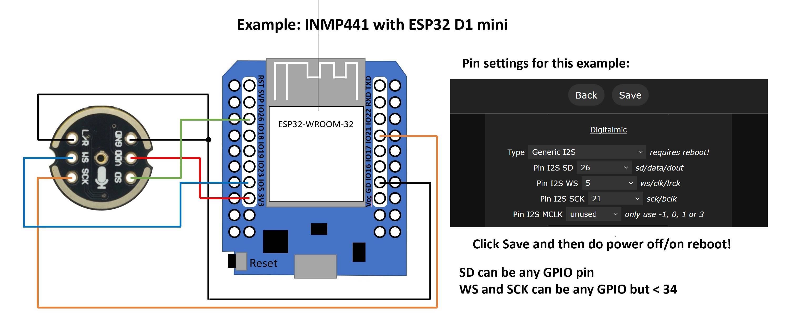
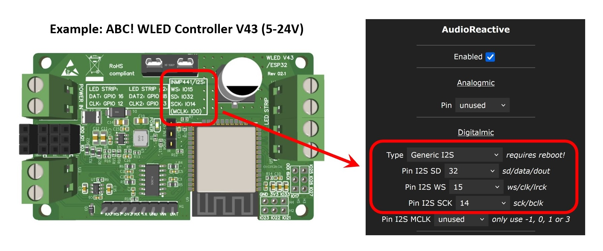
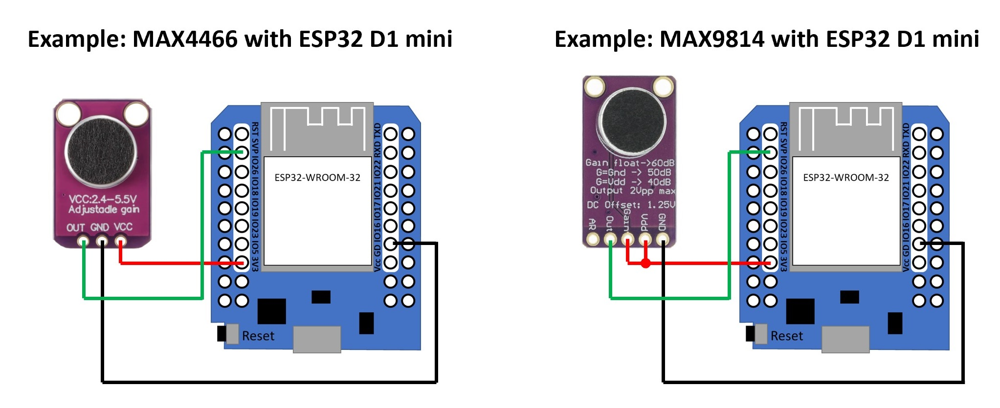
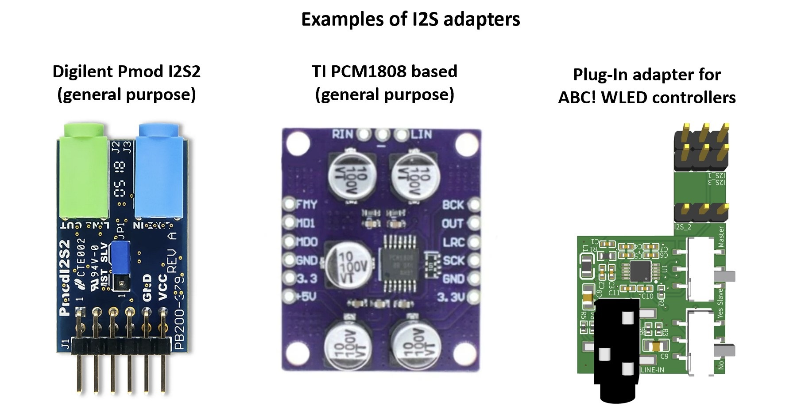
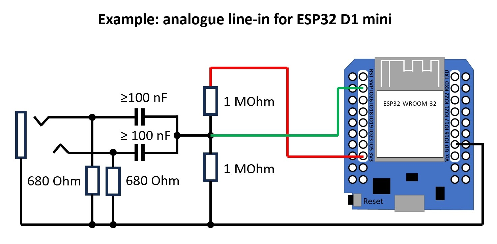

## What is Audio Reactive WLED?

Audio Reactive WLED lets your LEDs react to music and sound in real time. Originally implemented as the [Sound Reactive Fork](https://github.com/atuline/WLED), audio reactivity became an official usermod in WLED 0.14.0 and has been included in every official release since 0.15.0.

## Hardware Required

Audio must be fed into the microcontroller. There are four options: a microphone, a line-in adapter, another WLED instance, or a PC running audio-sync software.

### Supported ESP / Microcontrollers

Audio Reactive (AR) works across the ESP family, with a few differences per variant:

- **Classic ESP32** — full support: digital and analog microphones
- **ESP32-S3** — digital and PDM microphones only
- **ESP32-S2** — digital microphones only (no PDM)
- **ESP32-C3** — digital microphones only (since WLED v16.0)
- **ESP8266** — no microphone input; can participate in AR via network sync (receive mode only)

### Microphones

#### I2S Digital Microphones — Recommended

Examples: INMP441, ICS-43434, ICS-43432.

These microphones have an integrated ADC and output a clean digital signal. They give the best audio quality. The trade-off is that they need several GPIO pins, so keep wiring short and well-soldered to avoid noise issues.

Some commercial controllers come with an integrated digital microphone or a plug-in socket for one. Check the board's silkscreen or manual for the correct GPIO assignments.

#### PDM Microphones

Example: SPM1423.

PDM microphones are also digital with an integrated Sigma-Delta ADC. They're slightly cheaper than I2S microphones, need one fewer GPIO pin, and deliver good quality. PDM is supported on Classic ESP32 and ESP32-S3 only.

#### Analog Microphones — Not Recommended

Examples: MAX4466, MAX9814.

These are the simplest to wire (just 3.3 V, GND, and one ADC pin), but the quality is poor. The ESP32's built-in ADC is not well suited for audio and is easily affected by power supply noise. Use a digital microphone instead if at all possible.

**Recommended analog GPIO pins (Classic ESP32 only):** GPIO 36 (also labelled VP or ADC1\_CH0) is the best choice. GPIO 32–39 on ADC1 all work. **Do not use any ADC2 pin** (GPIO 0, 2, 4, 12–15, 25–27) — ADC2 conflicts with the WiFi radio and with I2S sampling, causing unreliable results.

!!! warning "Analog microphones and analog buttons are mutually exclusive"
    WLED can use an analog microphone **or** [analog buttons](/features/macros/#analog-button), but not both at the same time.

### Line-In Options

Both analog and digital line-in work with the line-out / headphone-out of a sound system, TV, phone, etc.

#### Line-In to I2S Adapter — Best Option

An analog-to-I2S adapter (using chips such as the CirrusLogic CS5343, TI PCM1808, or ES7243) converts the analog line signal to a clean digital I2S stream. This works the same as a digital I2S microphone in WLED, but you'll need an extra GPIO for MCLK (Master Clock). On ESP32, MCLK can only be generated on GPIOs 0, 1, or 3. Because MCLK is a high-frequency signal, keep those wires very short.

An example board with integrated line-in is the [LyraT](https://docs.espressif.com/projects/esp-adf/en/latest/design-guide/dev-boards/board-esp32-lyrat-v4.3.html).

#### Analog Line-In

A simple conditioning circuit (shown below) is needed to scale the line-out signal down to a level the ESP32 ADC can handle. Quality is limited for the same reasons as with analog microphones — this is a fallback option when an I2S adapter isn't available.

In a pinch you can connect audio GND and one audio channel directly to an ESP32 ADC pin (e.g. GPIO 36), but results vary widely and this is not recommended for permanent installs.

For more detail, see the [Sound Reactive WLED Wiki](https://mm.kno.wled.ge/soundreactive/introduction/).

!!! warning "Press Reset after changing the microphone type"
    After saving a change to the microphone type (or any audio input setting), press the physical **RST** button on your ESP32. WLED can't reconfigure the audio input on the fly — the I2S driver is set up at boot, so only a hard CPU reset picks up the new configuration.

## Configuration

The Audio Reactive settings page (**Config → Audio Reactive**) lets you tune how WLED responds to sound. The most important controls are Squelch, Gain, and AGC.

### Squelch

Squelch sets the noise floor — the minimum signal level that WLED treats as "sound". Any input below this threshold is ignored, so your LEDs stay still during silence instead of flickering from background noise.

Start with a higher squelch value and lower it until the LEDs just stop reacting to ambient noise in your room. A good squelch value means no activity in silence, but an instant response when music starts.

### Gain

Gain amplifies the input signal before processing. The range is 1–255, which corresponds to roughly –20 dB to +16 dB. Use gain to match the signal level from your specific microphone or line-in source to the expected input range.

Line-in signals are typically lower than microphone signals, so you'll usually need a higher gain setting for line-in.

### AGC — Automatic Gain Control

AGC automatically adjusts the internal gain based on how loud the audio currently is — so you don't have to keep tweaking the Gain slider as the volume changes. The prerequisite is that **Squelch is set correctly first**, so AGC knows what "silence" looks like.

Four modes are available:

| Mode | Behaviour |
|---|---|
| **Off** | No automatic adjustment. WLED uses the Gain value exactly as set. |
| **Normal** | Smoothly follows changes in volume. A good default for most setups. |
| **Vivid** | Reacts quickly to volume changes. More dramatic LED response to dynamics. |
| **Lazy** | Slower to adjust. Works well for GEQ effects or music with wide dynamic range. |

### First-Time Setup

Here's a reliable method for dialling in squelch and gain on a new device:

1. Select the **\*Gravimeter** effect and leave its sliders at their default positions.
2. Go to **Config → Audio Reactive**.
3. Set **Gain** to a high value (e.g. 200+), set **Squelch** to `1`, and turn **AGC** off. Save.
4. The LEDs should now react to almost anything, even ambient noise.
5. In a quiet environment, **gradually increase Squelch** (saving each time) until the LEDs stop reacting to background noise.
6. Once silence is stable, **lower Gain to around 40** and play music at normal volume. Adjust Gain until the LEDs respond as expected.
7. Optionally, enable **AGC** (Normal mode is a good starting point) and it will handle volume changes from here.

## Audio Sync

You don't need a microphone on every WLED device. One device captures the audio and shares it over the network; the rest just receive.

### WLED-to-WLED Sync

In the Audio Reactive settings, set one device to **Send** mode and all others to **Receive**. The sending device multicasts audio data to UDP multicast address `239.0.0.1`, default port `11988`. All receiving devices on the same network pick it up automatically.

You can change the UDP port in the Audio Reactive settings — useful if you want to run multiple independent sync groups on the same network.

This also means that ESP8266 devices can take full advantage of Audio Reactive effects — they just need to be set to receive mode and have a WLED ESP32 on the same network doing the audio capture.

!!! tip "Sync not working or delayed?"
    Disable **Wi-Fi Multimedia (WMM) Mode / QoS** on your Wi-Fi router. This setting can interfere with UDP multicast and is a common cause of sync dropouts or latency.

### Audio Sync from a PC

Any of the following tools can capture audio from your computer, process it into WLED Audio Sync format, and broadcast it on your network — emulating a WLED device in send mode. Set all your WLED instances to receive.

| Tool | Platform | Notes |
|---|---|---|
| [WledSRServer](https://github.com/Victoare/SR-WLED-audio-server-win) | Windows | Simple standalone app; sends V2 sync packets. |
| [Feed\_My\_WLED](https://github.com/chrisgott/feed_my_wled) | macOS / Linux | Python script; good choice for non-Windows users. |
| [WLEDAudioSync for Chataigne](https://github.com/zak-45/WLEDAudioSync-Chataigne-Module) | Cross-platform | Feature-rich audio toolset for [Chataigne](https://benjamin.kuperberg.fr/chataigne/); suits complex setups. |

## Audio Reactive Palettes

Most WLED effects that support palette colouring (the majority of them) pick colours by looking up a position in the active palette. Audio Reactive takes advantage of this by providing three special palettes whose colours are driven by live audio data — so any palette-aware effect automatically becomes audio responsive when one of these palettes is selected.

### Enabling the Palettes

The palettes are off by default. To enable them, go to **Config → Audio Reactive** and turn on **Add Palettes**. This adds three new entries to the palette list, all prefixed with `AudioReactive:`.

_This feature was contributed by [@netmindz](https://github.com/netmindz)._

### The Three Palettes

Each palette is a four-stop dynamic gradient that is recalculated every frame from the current FFT frequency data.

| Palette | How it works |
|---|---|
| **AudioReactive: Ratio** | Builds RGB values directly from three frequency bands (sub-bass, mid, and upper-mid). The ratio between those bands determines the resulting colour mix. |
| **AudioReactive: Hue** | Maps palette position across the lower frequency bands. Each band's amplitude sets both the hue and brightness, giving a colour that shifts with the dominant low frequency. |
| **AudioReactive: Spectrum** | Maps palette position across all 16 GEQ frequency channels. Each channel's amplitude drives the hue for its slice of the palette, so the full frequency spectrum is visible as colour. |

### Tips

- These palettes work with **any** effect that reads from the active palette — not just effects designed for audio. Try them with effects like Fire, Noise, or Plasma to get audio-driven colour without needing a dedicated AR effect.
- Because the palette refreshes every frame, the colour changes are as fast and smooth as your audio input.
- Combine with the **Squelch** setting in Audio Reactive to keep colours steady during quiet passages.

## Software

Audio Reactive is included in all official WLED builds from v0.15.0 onwards. The [official WLED web installer](https://install.wled.me/) includes it by default. No custom build is needed.
