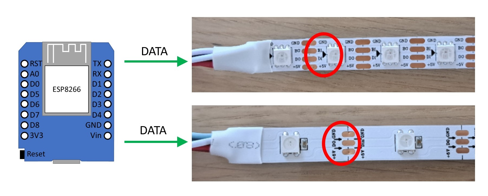
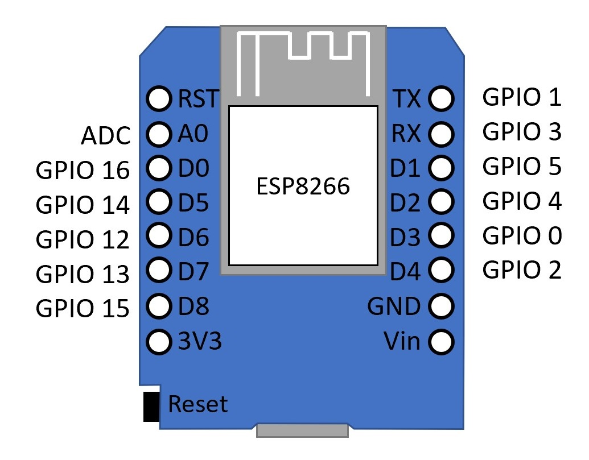
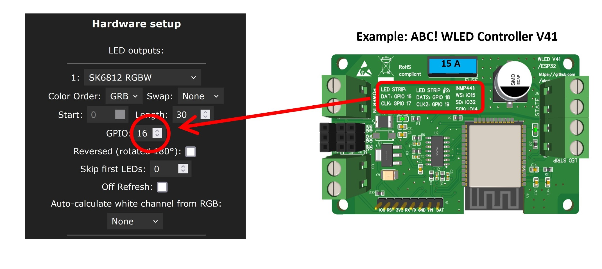
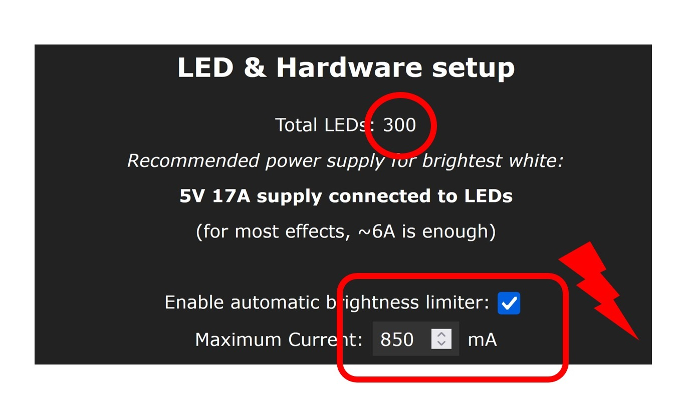

### Asking for help

Before asking for help on Discord or on other platforms, check the following top 5 most common mistakes while setting up WLED.
If you're still having trouble and want to ask for help, share as much detail as possible: describe your setup, take photos, and add screenshots of your settings. You can also use the [WLED Wiring Designer Tool](https://wled-wiring.github.io/) to create a wiring diagram, validate it with the built-in checker, and simulate current flow.

### TOP 5 mistakes:

1. LED strip is connected from the back side: addressable LED strips have a direction indicated by small arrows on the strip. The data line must be connected from the side where the arrow begins:
    
2. Incorrect GPIO is set: check in WLED settings whether the correct GPIO number is set as data output. Take care while using ESP8266 D1 mini: the pin labels like "D0", "D1" etc. are not the same numbers as GPIOs. In WLED preferences you have to use GPIO numbers:
    
    The ready-to-use controllers usually have the correct settings printed either on the housing or on the circuit board as in this example:
    
3. LED strip with many LEDs is connected and configures, but the current limiter is still at the default value (850 mA). This often has the effect that LEDs either remain dark or flash briefly when the color changes and then go out immediately or light up very dimly. Check and, if necessary, correct the settings in WLED:
    
4. Wrong LED type is set. The correct LED type and the correct color sequence (RGB, BGR, etc.) must be set in WLED LED preferences. Check that these settings are correct. You have to know the LED type, but you can simply try out the color sequence to see which is the right one. Special attention must be paid for example to the WS2814 LED strip, which must be set as SK6812 and not as WS281x in the LED preferences.
    
5. Wiring is bad. Wiring must be done thoroughly. Loose contacts, cold solder joints etc. must be avoided. You also need to be careful about the correct sizing of the cables: too thin wires can not only cause high voltage drop but also lead to an overheating and fire! For wire sizing you may use this [LED power, wiring and fuse calculator](https://wled-calculator.github.io/). If many power sources are used (for example separate one for ESP and separate one for the LED strip), then all their grounds (GND, V-) must be connected together (but do not connect their V+ together!).

### More to consider

#### Take care of PSU used

Pay close attention to the power supply unit (PSU) you use. Flickering in addressable LED strips is somethimes caused by poor-quality PSUs that generate significant electromagnetic interference (EMI).

When selecting a PSU, don’t rely solely on general customer reviews. Make sure the unit has been successfully used specifically with addressable LED strips (e.g., WS2812, SK6812). Many inexpensive PSUs receive positive reviews but are primarily used with analog LED strips.

Analog LEDs are relatively tolerant of voltage fluctuations and electrical noise. In contrast, addressable LEDs require a stable voltage and low-noise power supply to function correctly, as they rely on precise digital signaling.

Audible artifacts such as humming, buzzing, or high-pitched whining can indicate poor PSU design or low component quality. These issues often correlate with unstable output and increased electrical noise, which can directly affect LED performance.
