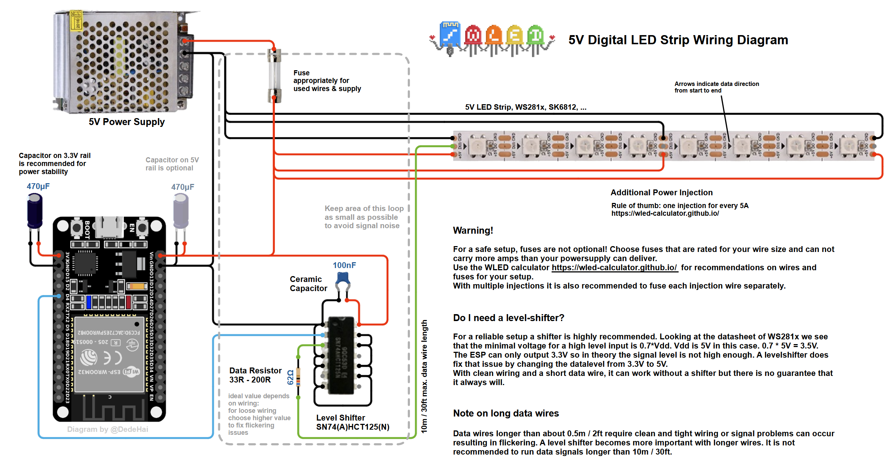
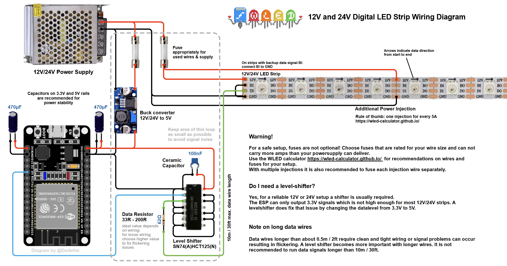
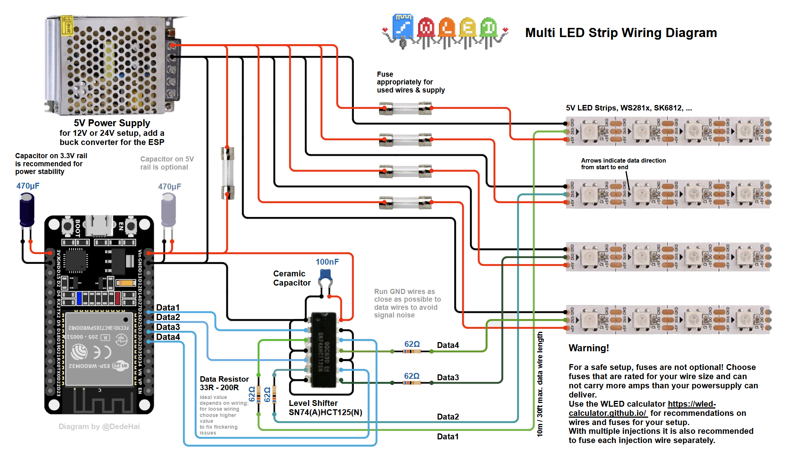
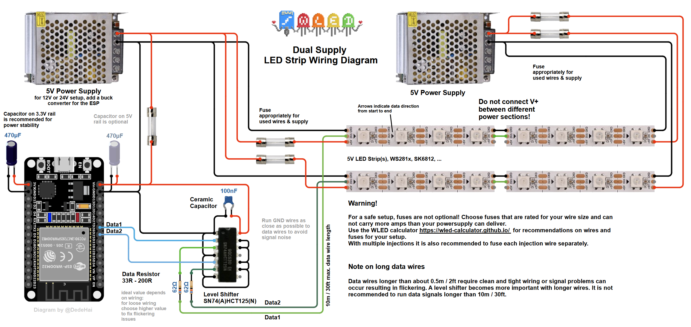
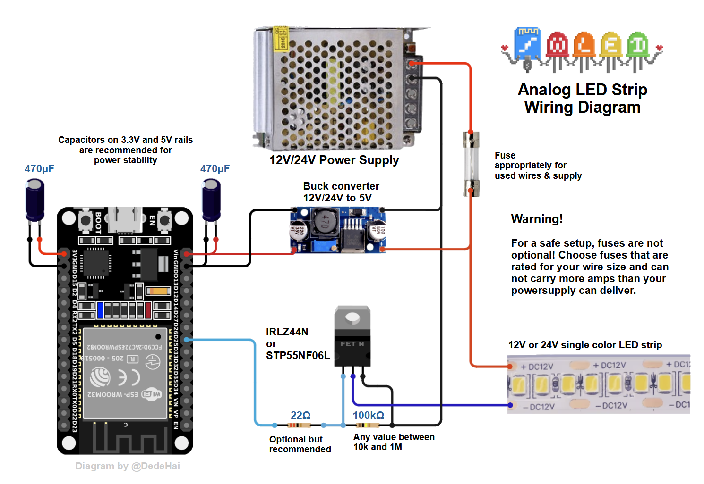
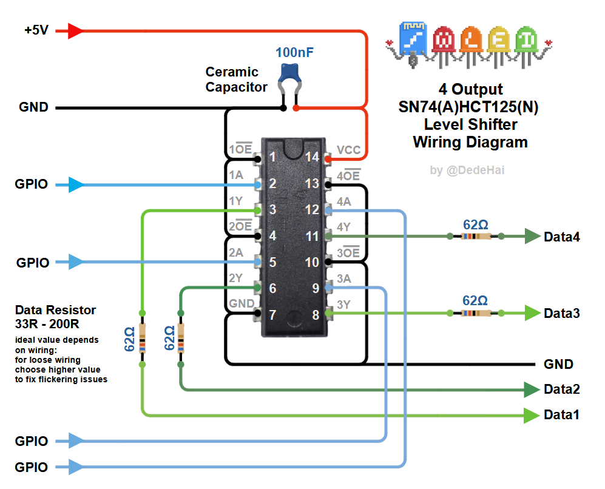

## Addressable LED Strips

## Non-Addressable LED Strips

More info on analog LEDs can be found [here](/basics/compatible-led-strips/#non-addressable-led-strips)

## Levelshifter

The SN74(A)HCT125(N) can be wired in different ways. The diagrams show the easiest wiring by connecting unused inputs to GND and leaving unused outputs unconnected. In general:

- Inputs 1A to 4A: connect unused inputs to GND
- Connect the output disable pins 1OE to 4OE to GND, enabling all outputs
- Outputs 1Y to 4Y: leave unused outputs unconnected 

