!!! info "Version Info"
    Effects above 117 are only available 0.14+ or Sound Reactive forks.  
    v16.0 adds 36 new effects — see [Effects available since 16.0](#effects-available-since-160) below.  
    [Retired Effects](#retired-effects) - Can't find an old favorite? Look here.

## New in v16.0

v16.0 adds **36 new effects** across 1D, 2D, and the Particle System:

**1D Particle System effects** (requires [Particle System](/features/particle-system)):
PS DripDrop, PS Pinball, PS Dancing Shadows, PS Fireworks 1D, PS Sparkler, PS Hourglass, PS Spray 1D, PS 1D Balance, PS Chase, PS Starburst, PS GEQ 1D, PS Fire 1D, PS Sonic Stream, PS Sonic Boom, PS Spring

**2D Particle System effects** (requires a 2D segment):
PS Fire, PS Waterfall, PS Vortex, PS Fireworks, PS Volcano, PS Ballpit, PS Box, PS Fuzzy Noise, PS Impact, PS Attractor, PS Spray, PS GEQ Nova, PS Ghost Rider, PS Blobs, PS Galaxy, PS GEQ 2D

**Other new effects:**
PacMan, Shimmer, Color Clouds, Image, Slow Transition, Copy Segment

**user_fx usermod effects** (requires `user_fx` usermod build):
Diffusion Fire, Spinning Wheel, Lava Lamp, Magma, Ants, Morse Code, PS Comet

## Effect Overlay
Since 16.0 true segment & effect overlay is supported.

To use overlay, set up segments with overlapping pixels. Multiple segments can be composited. For each segment, you can select the overlay mode:

| Mode | Description |
|------|-------------|
| Top/Default | Shows only the top layer, ignoring the bottom entirely |
| Bottom/None | Shows only the bottom layer, ignoring the top entirely |
| Add | Adds colors together, clamping at white |
| Subtract | Subtracts the top from the bottom, darkening toward black |
| Difference | Absolute difference between layers — identical colors go black, opposites go bright |
| Average | Evenly blends both layers at 50% each |
| Multiply | Multiplies colors together — white acts as a mask to bottom layer |
| Divide | Divides bottom by top — brightens the bottom where the top is dark |
| Lighten | Picks the brighter of the two layers pixel-by-pixel. |
| Darken | Picks the darker of the two layers pixel-by-pixel. |
| Screen | Inverse of multiply — always brightens, white wins, black is neutral. |
| Overlay | Multiplies dark areas and screens bright areas of the bottom layer — boosts contrast. |
| Hard Light | Like overlay but driven by the top layer — top controls contrast boosting. |
| Soft Light | Softer version of overlay — subtle contrast and saturation boost, no clipping. |
| Dodge | Brightens the bottom layer based on the top — light top = strong brightening. |
| Burn | Darkens the bottom layer based on the top — dark top = strong darkening. |
| Stencil | Shows top where it has any color, bottom where it is black. |

In older WLED versions not all effects do support overlay and the overlay effect must be playing on the segment with the higher id.
If the Overlay option is checked, the background will not be painted and the effect
from the lower segment will be displayed.

To aid in showing where colors vs palettes are used, all effects are rendered with the 
_Party_ palette  
and the colors:  
 Primary (_Fx_) 
 (or black) Secondary  (_Bg_) 
 Tertiary (_Cs_). 
For 2D effects the background (secondary) color is set to black.

## Effects

|  ID | Effect              | Description                                                                                                                                                                                                                                                            | Flags | Colors                                  | Parameters                                                                      |
|:----|---------------------|------------------------------------------------------------------------------------------------------------------------------------------------------------------------------------------------------------------------------------------------------------------------|-------|-----------------------------------------|-------------------------------------------------------------------------------|
| 186 | Akemi               | The WLED mascot rocking to your tunes.   { width="300" }                                                                                                                                    | ▦ ♫   | Head palette, Arms & Legs, Eyes & Mouth | Color speed, Dance                                                            |
|  27 | Android             | Section of varying length running   { width="300" }                                                                                                                                         | ⋮     | 🎨 Fx, Bg                               | Speed, Width                                                                  |
|  38 | Aurora              | Simulation of the Aurora Borealis   { width="300" }                                                                                                                                         | ⋮     | 🎨 1, 2, 3                              | Speed, Intensity                                                              |
| 183 | Black Hole          | Colorful dots orbiting a white black hole.   { width="300" }                                                                                                                                | ▦     | 🎨 Fx                                   | Fade rate, Outer Y freq., Outer X freq., Inner X freq., Inner Y freq., Solid  |
| 115 | Blends              | Blends random colors across palette   { width="300" }                                                                                                                                       | ⋮     | 🎨                                      | Shift speed, Blend speed                                                      |
|   1 | Blink               | Blinks between primary and secondary color   { width="300" }                                                                                                                                | ⋮     | 🎨 Fx, Bg                               | Speed, Duty cycle                                                             |
|  26 | Blink Rainbow       | Same as blink, cycles through the rainbow   { width="300" }                                                                                                                                 | ⋮     | 🎨 Fx, Bg                               | Frequency, Blink duration                                                     |
| 121 | Blobs               | No really, they are blobs.   { width="300" }                                                                                                                                                | ▦     | 🎨 Fx                                   | Speed, # blobs, Blur                                                          |
| 163 | Blurz               | Flash an fftResult bin per frame and then blur/fade.   { width="300" }                                                                                                                      | ⋮ ♫   | 🎨 Fx, Color mix                        | Fade rate, Blur                                                               |
|  91 | Bouncing Balls      | Bouncing ball effect   { width="300" }                                                                                                                                                      | ⋮     | 🎨 Fx, Bg, Cs                           | Gravity, # of balls, Overlay                                                  |
|  68 | Bpm                 | Pulses moving back and forth on palette   { width="300" }                                                                                                                                   | ⋮     | 🎨 Fx                                   | Speed                                                                         |
|   2 | Breathe             | Fades between primary and secondary color   { width="300" }                                                                                                                                 | ⋮     | 🎨 Fx, Bg                               | Speed                                                                         |
|  88 | Candle              | Flicker resembling a candle flame   { width="300" }                                                                                                                                         | ⋮     | 🎨 Fx, Bg                               | Speed, Intensity                                                              |
| 102 | Candle Multi        | Like candle effect, but each LED has it's own flicker pattern   { width="300" }                                                                                                             | ⋮     | 🎨 Fx, Bg                               | Speed, Intensity                                                              |
|  28 | Chase               | 2 LEDs in primary color running on secondary   { width="300" }                                                                                                                              | ⋮     | 🎨 Fx, Bg, Cs                           | Speed, Width                                                                  |
|  37 | Chase 2             | Pattern of n LEDs primary and n LEDs secondary moves along the strip   { width="300" }                                                                                                      | ⋮     | 🎨 Fx, Bg                               | Speed, Width                                                                  |
|  54 | Chase 3             | Like Chase, but with 3 colors   { width="300" }                                                                                                                                             | ⋮     | 🎨 1, 2, 3                              | Speed, Size                                                                   |
|  31 | Chase Flash         | 2 LEDs flash in secondary color while the rest is lit in primary. The flashing LEDs wander from start to end   { width="300" }                                                              | ⋮     | 🎨 Bg, Fx                               | Speed                                                                         |
|  32 | Chase Flash Rnd     | Like Chase Flash, but the 2 LEDs flash in random colors and leaves a random color behind   { width="300" }                                                                                  | ⋮     | 🎨 Fx, Bg                               | Speed                                                                         |
|  30 | Chase Rainbow       | Like 28 but leaves trail of rainbow   { width="300" }                                                                                                                                       | ⋮     | 🎨 Fx, Bg                               | Speed, Width                                                                  |
|  29 | Chase Random        | Like Chase but leaves trail of random color   { width="300" }                                                                                                                               | ⋮     | 🎨 Fx, Cs                               | Speed, Width                                                                  |
| 111 | Chunchun            | Birds flying in a circle formation   { width="300" }                                                                                                                                        | ⋮     | 🎨 Fx, Bg                               | Speed, Gap size                                                               |
| 167 | Colored Bursts      | Rotating rays of color.   { width="300" }                                                                                                                                                   | ▦     | 🎨                                      | Speed, # of lines, Blur, Gradient, Dots                                       |
|  34 | Colorful            | Shifting Red-Amber-Green-Blue pattern   { width="300" }                                                                                                                                     | ⋮     | 🎨 1, 2, 3                              | Speed, Saturation                                                             |
|   8 | Colorloop           | Cycle all LEDs through the rainbow colors   { width="300" }                                                                                                                                 | ⋮     | 🎨                                      | Speed, Saturation                                                             |
|  74 | Colortwinkles       | LEDs light up randomly in random colors and fade off again   { width="300" }                                                                                                                | ⋮     | 🎨                                      | Fade speed, Spawn speed                                                       |
|  67 | Colorwaves          | Like Pride 2015, but uses palettes   { width="300" }                                                                                                                                        | ⋮     | 🎨 Fx                                   | Speed, Hue                                                                    |
| 119 | Crazy Bees          | Bees darting from flower to flower.   { width="300" }                                                                                                                                       | ▦     |                                         | Speed, Blur                                                                   |
| 159 | DJ Light            | An effect emanating from the center to the edges.   { width="300" }                                                                                                                         | ⋮ ♫   |                                         | Speed                                                                         |
| 152 | DNA                 | A very cool DNA like pattern.   { width="300" }                                                                                                                                             | ▦     | 🎨                                      | Scroll speed, Blur                                                            |
| 182 | DNA Spiral          | Spiraling DNA pattern   { width="300" }                                                                                                                                                     | ▦     | 🎨                                      | Scroll speed, Y frequency                                                     |
| 112 | Dancing Shadows     | Moving spotlights   { width="300" }                                                                                                                                                         | ⋮     | 🎨 Fx                                   | Speed, # of shadows                                                           |
|  18 | Dissolve            | Fills LEDs with primary in random order, then off again   { width="300" }                                                                                                                   | ⋮     | 🎨 Fx, Bg                               | Repeat speed, Dissolve speed, Random                                          |
|  19 | Dissolve Rnd        | Fills LEDs with random colors in random order, then off again   { width="300" }                                                                                                             | ⋮     | 🎨 Bg                                   | Repeat speed, Dissolve speed                                                  |
| 124 | Distortion Waves    | Distorted sine waves with a psychedelic flair.   { width="300" }                                                                                                                            | ▦     |                                         | Speed, Scale                                                                  |
| 164 | Drift               | A rotating kaleidoscope.   { width="300" }                                                                                                                                                  | ▦     | 🎨                                      | Rotation speed, Blur amount                                                   |
| 123 | Drift Rose          | Spinning arms that adds and removes nodes as it winds and unwinds.   { width="300" }                                                                                                        | ▦     |                                         | Fade, Blur                                                                    |
|  96 | Drip                | Water dripping effect   { width="300" }                                                                                                                                                     | ⋮     | 🎨 Fx, Bg                               | Gravity, # of drips, Overlay                                                  |
|   7 | Dynamic             | Sets each LED to a random color   { width="300" }                                                                                                                                           | ⋮     | 🎨                                      | Speed, Intensity, Smooth                                                      |
| 117 | Dynamic Smooth      | Like Dynamic, but with smooth palette blends   { width="300" }                                                                                                                              | ⋮     | 🎨                                      | Speed, Intensity                                                              |
|  12 | Fade                | Fades smoothly between primary and secondary color   { width="300" }                                                                                                                        | ⋮     | 🎨 Fx, Bg                               | Speed                                                                         |
|  49 | Fairy               | Inspired by twinkle style Christmas lights.   { width="300" }                                                                                                                               | ⋮     | 🎨 Fx, Bg                               | Speed, # of flashers                                                          |
|  51 | Fairytwinkle        | Like Colortwinkle, but starting from all lit   { width="300" }                                                                                                                              | ⋮     | 🎨 Fx, Bg                               | Speed, Intensity                                                              |
|  69 | Fill Noise          | Noise pattern   { width="300" }                                                                                                                                                             | ⋮     | 🎨 Fx                                   | Speed                                                                         |
|  66 | Fire 2012           | Simulates flickering fire in red and yellow   { width="300" }                                                                                                                               | ⋮     | 🎨                                      | Cooling, Spark rate, Boost                                                    |
|  45 | Fire Flicker        | LEDs randomly flickering   { width="300" }                                                                                                                                                  | ⋮     | 🎨 Fx                                   | Speed, Intensity                                                              |
| 149 | Firenoise           | Using Perlin Noise for fire.   { width="300" }                                                                                                                                              | ▦     | 🎨                                      | X scale, Y scale                                                              |
|  42 | Fireworks           | Random color blobs light up, then fade again   { width="300" }                                                                                                                              | ⋮ ▦   | 🎨 Fx, Bg                               | Frequency                                                                     |
|  90 | Fireworks 1D        | one dimension fireworks with flare   { width="300" }                                                                                                                                        | ⋮ ▦   | 🎨 Fx, Bg                               | Gravity, Firing side                                                          |
|  89 | Fireworks Starburst | Exploding multicolor fireworks   { width="300" }                                                                                                                                            | ⋮     | 🎨 Bg                                   | Chance, Fragments, Overlay                                                    |
| 110 | Flow                | Blend of palette and spot effects   { width="300" }                                                                                                                                         | ⋮     | 🎨                                      | Speed, Zones                                                                  |
| 179 | Flow Stripe         | Strip with rotating colours.   { width="300" }                                                                                                                                              | ⋮     |                                         | Hue speed, Effect speed                                                       |
| 155 | Freqmap             | Map the loudest frequency throughout the length of the LED's.   { width="300" }                                                                                                             | ⋮ ♫   | 🎨 Fx, Bg                               | Fade rate, Starting color                                                     |
| 138 | Freqmatrix          | The temporal tail for this animation starts at the beginning of the Segment rather than in the center of the segment.   { width="300" }                                                     | ⋮ ♫   |                                         | Speed, Sound effect, Low bin, High bin, Sensivity                             |
| 141 | Freqpixels          | Random pixels coloured by frequency.   { width="300" }                                                                                                                                      | ⋮ ♫   |                                         | Fade rate, Starting color and # of pixels                                     |
| 137 | Freqwave            | Maps the major frequencies from the incoming signal to colors in the HSV color space.   { width="300" }                                                                                     | ⋮ ♫   |                                         | Speed, Sound effect, Low bin, High bin, Pre-amp                               |
| 177 | Frizzles            | Moving patterns.   { width="300" }                                                                                                                                                          | ▦     | 🎨                                      | X frequency, Y frequency, Blur                                                |
| 160 | Funky Plank         | A 2D wall of reactivity running from bottom to top   { width="300" }                                                                                                                        | ▦ ♫   |                                         | Scroll speed, # of bands                                                      |
| 139 | GEQ                 | A 16x16 graphic equalizer.   { width="300" }                                                                                                                                                | ▦ ♫   | 🎨 Fx, Peaks                            | Fade speed, Ripple decay, # of bands, Color bars                              |
| 172 | Game Of Life        | Scrolling game of life.   { width="300" }                                                                                                                                                   | ▦     | 🎨 Fx, Bg                               | Speed                                                                         |
| 120 | Ghost Rider         | Color changing ghost riding a kite... in a tornado.   { width="300" }                                                                                                                       | ▦     | 🎨                                      | Fade rate, Blur                                                               |
|  87 | Glitter             | Rainbow with white sparkles   { width="300" }                                                                                                                                               | ⋮     | 🎨 1, 2, Glitter color                  | Speed, Intensity, Overlay                                                     |
|  46 | Gradient            | Moves a saturation gradient of the primary color along the strip   { width="300" }                                                                                                          | ⋮     | 🎨 Fx, Bg                               | Speed, Spread                                                                 |
| 156 | Gravcenter          | Volume reactive vu-meter from center with gravity and perlin noise.   { width="300" }                                                                                                       | ⋮ ♪   | 🎨 Fx, Bg                               | Rate of fall, Sensitivity                                                     |
| 157 | Gravcentric         | Volume reactive vu-meter from center with gravity. Volume provides index to (time rotating) palette colour.   { width="300" }                                                               | ⋮ ♪   | 🎨 Fx, Bg                               | Rate of fall, Sensitivity                                                     |
| 158 | Gravfreq            | VU Meter from center. Log of frequency is index to center colour.   { width="300" }                                                                                                         | ⋮ ♫   | 🎨 Fx, Bg                               | Rate of fall, Sensivity                                                       |
| 132 | Gravimeter          | Volume reactive vu-meter with gravity and perlin noise.   { width="300" }                                                                                                                   | ⋮ ♪   | 🎨 Fx, Bg                               | Rate of fall, Sensitivity                                                     |
|  82 | Halloween Eyes      | One Pair of blinking eyes at random intervals along strip   { width="300" }                                                                                                                 | ⋮ ▦   | 🎨 Fx, Bg                               | Duration, Eye fade time, Overlay                                              |
| 100 | Heartbeat           | led strip pulsing rhythm similar to a heart beat   { width="300" }                                                                                                                          | ⋮     | 🎨 Fx, Bg                               | Speed, Intensity                                                              |
| 180 | Hiphotic            | A moving plasma.   { width="300" }                                                                                                                                                          | ▦     | 🎨 Fx                                   | X scale, Y scale, Speed                                                       |
|  58 | ICU                 | Two "eyes" running on opposite sides of the strip   { width="300" }                                                                                                                         | ⋮     | 🎨 Fx, Bg                               | Speed, Intensity, Overlay                                                     |
|  64 | Juggle              | Eight colored dots running, leaving trails   { width="300" }                                                                                                                                | ⋮     | 🎨                                      | Speed, Trail                                                                  |
| 130 | Juggles             | Juggling balls.   { width="300" }                                                                                                                                                           | ⋮ ♪   | 🎨 Fx, Bg                               | Speed, # of balls                                                             |
| 168 | Julia               | Animated Julia set fractal named after mathematician Gaston Julia.   { width="300" }                                                                                                        | ▦     | 🎨 Fx                                   | Max iterations per pixel, X center, Y center, Area size                       |
|  75 | Lake                | Calm palette waving   { width="300" }                                                                                                                                                       | ⋮     | 🎨 Fx                                   | Speed                                                                         |
|  41 | Lighthouse          | Dot moves from start to end, leaving behind a fading trail   { width="300" }                                                                                                                | ⋮     | 🎨 Fx, Bg                               | Speed, Fade rate                                                              |
|  57 | Lightning           | Short random white strobe similar to a lightning bolt   { width="300" }                                                                                                                     | ⋮     | 🎨 Fx, Bg                               | Speed, Intensity, Overlay                                                     |
| 176 | Lissajous           | A frequency based Lissajous pattern.   { width="300" }                                                                                                                                      | ▦     | 🎨 Fx                                   | X frequency, Fade rate, Speed                                                 |
|  47 | Loading             | Moves a sawtooth pattern along the strip   { width="300" }                                                                                                                                  | ⋮     | 🎨 Fx, Bg                               | Speed, Fade                                                                   |
| 131 | Matripix            | Similar to Matrix.   { width="300" }                                                                                                                                                        | ⋮ ♪   | 🎨 Fx, Bg                               | Speed, Brightness                                                             |
| 153 | Matrix              | The Matrix, on a 2D matrix.   { width="300" }                                                                                                                                               | ▦     | Spawn, Trail                            | Speed, Spawning rate, Trail, Custom color                                     |
| 154 | Metaballs           | A cool plasma type effect.   { width="300" }                                                                                                                                                | ▦     | 🎨                                      | Speed                                                                         |
|  76 | Meteor              | The primary color creates a trail of randomly decaying color   { width="300" }                                                                                                              | ⋮     | 🎨 Fx                                   | Speed, Trail length                                                           |
|  77 | Meteor Smooth       | Smoothly animated meteor   { width="300" }                                                                                                                                                  | ⋮     | 🎨 Fx                                   | Speed, Trail length                                                           |
| 135 | Midnoise            | Perlin noise emanating from center.   { width="300" }                                                                                                                                       | ⋮ ♪   | 🎨 Fx, Bg                               | Fade rate, Max. length                                                        |
|  59 | Multi Comet         | Like Scanner, but creates multiple trails   { width="300" }                                                                                                                                 | ⋮     |                                         |                                                                               |
|  70 | Noise 1             | Fast Noise shift pattern   { width="300" }                                                                                                                                                  | ⋮     | 🎨 Fx                                   | Speed                                                                         |
|  71 | Noise 2             | Fast Noise shift pattern   { width="300" }                                                                                                                                                  | ⋮     | 🎨 Fx                                   | Speed                                                                         |
|  72 | Noise 3             | Noise shift pattern   { width="300" }                                                                                                                                                       | ⋮     | 🎨 Fx                                   | Speed                                                                         |
|  73 | Noise 4             | Noise sparkle pattern   { width="300" }                                                                                                                                                     | ⋮     | 🎨 Fx                                   | Speed                                                                         |
| 107 | Noise Pal           | Peaceful noise that's slow and with gradually changing palettes   { width="300" }                                                                                                           | ⋮     | 🎨                                      | Speed, Scale                                                                  |
| 146 | Noise2D             |   { width="300" }                                                                                                                                                                           | ▦     | 🎨                                      | Speed, Scale                                                                  |
| 143 | Noisefire           | A perlin noise based volume reactive fire routine.   { width="300" }                                                                                                                        | ⋮ ♪   |                                         | Speed, Intensity                                                              |
| 136 | Noisemeter          | Volume reactive vu-meter.   { width="300" }                                                                                                                                                 | ⋮ ♪   | 🎨 Fx, Bg                               | Fade rate, Width                                                              |
| 145 | Noisemove           | Using perlin noise as movement for different frequency bins.   { width="300" }                                                                                                              | ⋮ ♫   | 🎨 Fx, Bg                               | Speed of perlin movement, Fade rate                                           |
| 126 | Octopus             | A cephalopod stuck in a whirlpool.   { width="300" }                                                                                                                                        | ▦     | 🎨                                      | Speed, Offset X, Offset Y, Legs                                               |
|  62 | Oscillate           | Areas of primary and secondary colors move between opposite ends, combining colors where they touch   { width="300" }                                                                       | ⋮     |                                         |                                                                               |
| 101 | Pacifica            | Gentle ocean waves   { width="300" }                                                                                                                                                        | ⋮     | 🎨                                      | Speed, Angle                                                                  |
|  65 | Palette             | Running color palette   { width="300" }                                                                                                                                                     | ⋮     | 🎨                                      | Cycle speed                                                                   |
|  98 | Percent             | Lights up a percentage of segment   { width="300" }                                                                                                                                         | ⋮     | 🎨 Fx, Bg                               | % of fill, One color                                                          |
| 147 | Perlin Move         | Using Perlin Noise for movement.   { width="300" }                                                                                                                                          | ⋮     | 🎨 Fx, Bg                               | Speed, # of pixels, Fade rate                                                 |
| 105 | Phased              | Sine waves (in sourcecode)   { width="300" }                                                                                                                                                | ⋮     | 🎨 Fx, Bg                               | Speed, Intensity                                                              |
| 109 | Phased Noise        | Noisy sine waves   { width="300" }                                                                                                                                                          | ⋮     | 🎨 Fx, Bg                               | Speed, Intensity                                                              |
| 128 | Pixels              | Random pixels   { width="300" }                                                                                                                                                             | ⋮ ♪   | 🎨 Fx, Bg                               | Fade rate, # of pixels                                                        |
| 129 | Pixelwave           | Pixels emanating from center   { width="300" }                                                                                                                                              | ⋮ ♪   | 🎨 Fx, Bg                               | Speed, Sensitivity                                                            |
|  97 | Plasma              | Plasma lamp   { width="300" }                                                                                                                                                               | ⋮     | 🎨 Fx                                   | Phase, Intensity                                                              |
| 178 | Plasma Ball         | A ball of plasma.   { width="300" }                                                                                                                                                         | ▦     | 🎨                                      | Speed, Fade, Blur                                                             |
| 133 | Plasmoid            | Sine wave based plasma.   { width="300" }                                                                                                                                                   | ⋮ ♪   | 🎨 Fx, Bg                               | Phase, # of pixels                                                            |
| 174 | Polar Lights        | The northern lights.   { width="300" }                                                                                                                                                      | ▦     |                                         | Speed, Scale                                                                  |
|  95 | Popcorn             | popping kernels   { width="300" }                                                                                                                                                           | ⋮     | 🎨 Fx, Bg, Cs                           | Speed, Intensity, Overlay                                                     |
|  63 | Pride 2015          | Rainbow cycling with brightness variation   { width="300" }                                                                                                                                 | ⋮     |                                         | Speed                                                                         |
| 144 | Puddlepeak          | Blast coloured puddles randomly up and down the strand with the 'beat'.   { width="300" }                                                                                                   | ⋮ ♪   | 🎨 Fx, Bg                               | Fade rate, Puddle size, Select bin, Volume (min)                              |
| 134 | Puddles             | Blast coloured puddles based on volume.   { width="300" }                                                                                                                                   | ⋮ ♪   | 🎨 Fx, Bg                               | Fade rate, Puddle size                                                        |
| 162 | Pulser              | Travelling waves.   { width="300" }                                                                                                                                                         | ▦     | 🎨                                      | Speed, Blur                                                                   |
|  78 | Railway             | Shows primary and secondary color on alternating LEDs. All LEDs fade to their opposite color and back again   { width="300" }                                                               | ⋮     | 🎨 1, 2                                 | Speed, Smoothness                                                             |
|  43 | Rain                | Like Fireworks, but the blobs move   { width="300" }                                                                                                                                        | ⋮ ▦   | 🎨 Fx, Bg                               | Speed, Spawning rate                                                          |
|   9 | Rainbow             | Displays rainbow colors along the whole strip   { width="300" }                                                                                                                             | ⋮     | 🎨                                      | Speed, Size                                                                   |
|  33 | Rainbow Runner      | Like Chase, but the 2 LEDs light up in rainbow colors and leave a primary color trail   { width="300" }                                                                                     | ⋮     | 🎨 Bg                                   | Speed, Size                                                                   |
|   5 | Random Colors       | Applies a new random color to all LEDs   { width="300" }                                                                                                                                    | ⋮     | 🎨                                      | Speed, Fade time                                                              |
|  79 | Ripple              | Effect resembling random water ripples   { width="300" }                                                                                                                                    | ⋮ ▦   | 🎨 Bg                                   | Speed, Wave #, Overlay                                                        |
| 148 | Ripple Peak         | Peak detection triggers ripples.   { width="300" }                                                                                                                                          | ⋮ ♪   | 🎨 Fx, Bg                               | Fade rate, Max # of ripples, Select bin, Volume (min)                         |
|  99 | Ripple Rainbow      | Like ripple, but with a dimly lit changing background   { width="300" }                                                                                                                     | ⋮ ▦   | 🎨                                      | Speed, Wave #                                                                 |
| 185 | Rocktaves           | Colours the same for each note between octaves, with sine wave going back and forth.   { width="300" }                                                                                      | ⋮ ♫   | 🎨 Fx, Bg                               |                                                                               |
|  15 | Running             | Sine Waves scrolling   { width="300" }                                                                                                                                                      | ⋮     | 🎨 Fx, Bg                               | Speed, Wave width                                                             |
|  52 | Running Dual        | Sine waves in both directions   { width="300" }                                                                                                                                             | ⋮     | 🎨 L, Bg, R                             | Speed, Wave width                                                             |
|  16 | Saw                 | Sawtooth Waves scrolling   { width="300" }                                                                                                                                                  | ⋮     | 🎨 Fx, Bg                               | Speed, Width                                                                  |
|  10 | Scan                | A single primary colored light wanders between start and end   { width="300" }                                                                                                              | ⋮     | 🎨 Fx, Bg, Cs                           | Speed, # of dots, Overlay                                                     |
|  11 | Scan Dual           | Same as Scan but uses two lights starting at both ends   { width="300" }                                                                                                                    | ⋮     | 🎨 Fx, Bg, Cs                           | Speed, # of dots, Overlay                                                     |
|  40 | Scanner             | Dot moves between ends, leaving behind a fading trail   { width="300" }                                                                                                                     | ⋮     | 🎨 Fx, Bg                               | Speed, Fade rate                                                              |
|  60 | Scanner Dual        | Like Scanner, but with two dots running on opposite sides   { width="300" }                                                                                                                 | ⋮     | 🎨 Fx, Bg, Cs                           | Speed, Fade rate                                                              |
| 122 | Scrolling Text      | Edit segment name to set text (variables #DATE, #TIME, #DDMM, #MMDD, #HHMM, #HH, #MM; suffix with 0 to have leading 0s, i.e. #DATE0). Use segment grouping to increase text size on a large matrix.  { width="300" }                                                                                                          | ▦     | 🎨 Fx, Bg, Gradient                     | Speed, Y Offset, Trail, Font size, Gradient, Overlay, 0                       |
| 181 | Sindots             | Dots revolving in a circle while the 'camera'    { width="300" }                                                                                                                            | ▦     | 🎨                                      | Speed, Dot distance, Fade rate, Blur                                          |
| 108 | Sine                | Controllable sine waves   { width="300" }                                                                                                                                                   | ⋮     |                                         |                                                                               |
|  92 | Sinelon             | Fastled sinusoidal moving eye   { width="300" }                                                                                                                                             | ⋮     | 🎨 Fx, Bg, Cs                           | Speed, Trail                                                                  |
|  93 | Sinelon Dual        | Sinelon from both directions   { width="300" }                                                                                                                                              | ⋮     | 🎨 Fx, Bg, Cs                           | Speed, Trail                                                                  |
|  94 | Sinelon Rainbow     | Sinelon in rainbow colours   { width="300" }                                                                                                                                                | ⋮     | 🎨 Cs                                   | Speed, Trail                                                                  |
| 125 | Soap                | Like soap bubbles, but lasts longer.   { width="300" }                                                                                                                                      | ▦     | 🎨                                      | Speed, Smoothness                                                             |
|   0 | Solid               | Solid primary color on all LEDs   { width="300" }                                                                                                                                           | ⋮     |                                         |                                                                               |
| 103 | Solid Glitter       | Like Glitter, but with solid color background   { width="300" }                                                                                                                             | ⋮     | Bg, Glitter color                       | Intensity                                                                     |
|  83 | Solid Pattern       | Speed sets number of LEDs on, intensity sets off   { width="300" }                                                                                                                          | ⋮     | 🎨 Fg, Bg                               | Fg size, Bg size                                                              |
|  84 | Solid Pattern Tri   | Solid Pattern with three colors   { width="300" }                                                                                                                                           | ⋮     | 1, 2, 3                                 | Size                                                                          |
| 118 | Spaceships          | Circling ships with fading trails. Homage to 80s spaceship shooter games.   { width="300" }                                                                                                 | ▦     | 🎨                                      | Speed, Blur                                                                   |
|  20 | Sparkle             | Single random LEDs light up in the primary color for a short time, secondary is background   { width="300" }                                                                                | ⋮     | 🎨 Fx, Bg                               | Speed, Overlay                                                                |
|  21 | Sparkle Dark        | All LEDs are lit in the primary color, single random LEDs turn off for a short time   { width="300" }                                                                                       | ⋮     | 🎨 Bg, Fx                               | Speed, Intensity, Overlay                                                     |
|  22 | Sparkle+            | All LEDs are lit in the primary color, multiple random LEDs turn off for a short time   { width="300" }                                                                                     | ⋮     | 🎨 Bg, Fx                               | Speed, Intensity, Overlay                                                     |
|  85 | Spots               | Solid lights with even distance   { width="300" }                                                                                                                                           | ⋮     | 🎨 Fx, Bg                               | Spread, Width, Overlay                                                        |
|  86 | Spots Fade          | Spots, getting bigger and smaller   { width="300" }                                                                                                                                         | ⋮     | 🎨 Fx, Bg                               | Spread, Width, Overlay                                                        |
| 150 | Squared Swirl       | Boxes moving around   { width="300" }                                                                                                                                                       | ▦     | 🎨                                      | Blur                                                                          |
|  39 | Stream              | Flush bands random hues along the string   { width="300" }                                                                                                                                  | ⋮     | 🎨                                      | Speed, Zone size                                                              |
|  61 | Stream 2            | Flush random hues along the string   { width="300" }                                                                                                                                        | ⋮     |                                         | Speed                                                                         |
|  23 | Strobe              | All LEDs are lit in the secondary color, all LEDs flash in a single short burst in primary color   { width="300" }                                                                          | ⋮     | 🎨 Fx, Bg                               | Speed                                                                         |
|  25 | Strobe Mega         | All LEDs are lit in the secondary color, all LEDs flash in several short bursts in primary color   { width="300" }                                                                          | ⋮     | 🎨 Fx, Bg                               | Speed, Intensity                                                              |
|  24 | Strobe Rainbow      | Same as strobe, cycles through the rainbow   { width="300" }                                                                                                                                | ⋮     | 🎨 Bg                                   | Speed                                                                         |
| 166 | Sun Radiation       | The sun! Doesn't support segments.   { width="300" }                                                                                                                                        | ▦     |                                         | Variance, Brightness                                                          |
| 104 | Sunrise             | Simulates a gradual sunrise or sunset. Speed sets: 0 - static sun, 1 - 60: sunrise time in minutes,60 - 120: sunset time in minutes - 60, above: "breathing" rise and set   { width="300" } | ⋮     | 🎨                                      | Time [min], Width                                                             |
|   6 | Sweep               | Switches between primary and secondary, switching LEDs one by one, start to end to start   { width="300" }                                                                                  | ⋮     | 🎨 Fx, Bg                               | Speed, Intensity                                                              |
|  36 | Sweep Random        | Like Sweep, but uses random colors   { width="300" }                                                                                                                                        | ⋮     | 🎨                                      | Speed                                                                         |
| 175 | Swirl               | Several blurred circles. Looks good with pink plasma palette. Supports AGC.   { width="300" }                                                                                               | ▦ ♪   | 🎨 Bg Swirl                             | Speed, Sensitivity, Blur                                                      |
| 116 | TV Simulator        | TV light spill simulation   { width="300" }                                                                                                                                                 | ⋮     |                                         | Speed, Intensity                                                              |
| 173 | Tartan              | Plaid pattern of horizontal and vertical bands. Makes a great kilt.   { width="300" }                                                                                                       | ▦     | 🎨                                      | X scale, Y scale, Sharpness                                                   |
|  44 | Tetrix              | Falling blocks stack   { width="300" }                                                                                                                                                      | ⋮     | 🎨 Fx, Bg                               | Speed, Width, One color                                                       |
|  13 | Theater             | Pattern of one lit and two unlit LEDs running   { width="300" }                                                                                                                             | ⋮     | 🎨 Fx, Bg                               | Speed, Gap size                                                               |
|  14 | Theater Rainbow     | Same as Theater but uses colors of the rainbow   { width="300" }                                                                                                                            | ⋮     | 🎨 Bg                                   | Speed, Gap size                                                               |
|  35 | Traffic Light       | Emulates a traffic light   { width="300" }                                                                                                                                                  | ⋮     | 🎨 Bg                                   | Speed, US style                                                               |
|  56 | Tri Fade            | Fades the whole strip from primary color to secondary color to off   { width="300" }                                                                                                        | ⋮     | 🎨 1, 2, 3                              | Speed                                                                         |
|  55 | Tri Wipe            | Like Wipe but turns LEDs off as "third color"   { width="300" }                                                                                                                             | ⋮     | 🎨 1, 2, 3                              | Speed                                                                         |
|  17 | Twinkle             | Random LEDs light up in the primary color with secondary as background   { width="300" }                                                                                                    | ⋮     | 🎨 Fx, Bg                               | Speed, Intensity                                                              |
|  81 | Twinklecat          | Twinkling with fast in / slow out   { width="300" }                                                                                                                                         | ⋮     | 🎨                                      | Speed, Twinkle rate                                                           |
|  80 | Twinklefox          | FastLED gentle twinkling with slow fade in/out   { width="300" }                                                                                                                            | ⋮     | 🎨                                      | Speed, Twinkle rate                                                           |
| 106 | Twinkleup           | Twinkle effect with fade-in   { width="300" }                                                                                                                                               | ⋮     | 🎨 Fx, Bg                               | Speed, Intensity                                                              |
|  50 | Two Dots            | Two areas sweeping   { width="300" }                                                                                                                                                        | ⋮     | 🎨 1, 2, Bg                             | Speed, Dot size, Overlay                                                      |
| 113 | Washing Machine     | Spins, slows, reverses directions   { width="300" }                                                                                                                                         | ⋮     | 🎨                                      | Speed, Intensity                                                              |
| 140 | Waterfall           | A volume AND FFT version of a Waterfall that has 'beat' support.   { width="300" }                                                                                                          | ⋮ ♫   | 🎨 Fx, Bg                               | Speed, Adjust color, Select bin, Volume (min)                                 |
| 165 | Waverly             | Noise waves with some sound.   { width="300" }                                                                                                                                              | ▦ ♪   | 🎨                                      | Amplification, Sensitivity                                                    |
| 184 | Wavesins            | Beat waves and phase shifting. Looks OK in 2D'ish as well.   { width="300" }                                                                                                                | ⋮     | 🎨 Fx                                   | Speed, Brightness variation, Starting color, Range of colors, Color variation |
| 127 | Waving Cell         | If a bunch of eucaryotes went to a sports stadium and did the wave, it would look exactly like this.   { width="300" }                                                                      | ▦     | 🎨                                      | Speed, Amplitude 1, Amplitude 2, Amplitude 3                                  |
|   3 | Wipe                | Switches between primary and secondary, switching LEDs one by one, start to end   { width="300" }                                                                                           | ⋮     | 🎨 Fx, Bg                               | Speed, Intensity                                                              |
|   4 | Wipe Random         | Same as Wipe, but uses random colors   { width="300" }                                                                                                                                      | ⋮     | 🎨                                      | Speed                                                                         |

### Effects available since 16.0
All new effects support palettes except pacman and image. Effects with the prefix "PS" use the particle system.

!!! info "Image Effect"
    * You can only have _one_ segment playing this effect
    * Segment name must be set to the file name (like "anim1.gif") on the esp32 filesystem.
    * Animated GIFs are _mostly_ supported natively by WLED i.e. even through a direct upload of the GIF using the file editor. 
    * If you experience issues, convert the GIF with the [PixelForge Image Tool](/features/pixelforge#image-tool).
    * Effect is **not available on ESP8266** due to limited RAM

| ID | Effect | Description | Flags | Colors | Parameters |
|:---|:---|:---|:---:|:---:|:---|
| 53 | **Image** | Animated GIF Image.   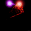{ width="300" } |  ⋮ ▦ | - | **Segment Name**:Image File Name `filename.gif`  **Speed:** Animation speed   **Blur:** Image blur   example image is from [marcmerlin/AnimatedGIFs](https://github.com/marcmerlin/AnimatedGIFs/blob/master/data64_2MB/gifs64/284_comets.gif){ width="300" }|
| 187 | **PS Volcano** | Erupting volcano.   { width="300" } | ▦ | 🎨 | **Speed:** Particle speed   **Intensity:** Particles emitted   **Move:** Movement velocity   **Bounce:** Collision hardness   **Spread:** Emitter variation   **AgeColor:** Color by particle age   **Walls:** Enable side boundaries   **Collide:** Enable particle-particle collisions |
| 188 | **PS Fire** | Versatile and quite realistic fire effect.   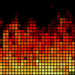{ width="300" } | ▦ | 🎨 | **Speed:** Flame speed   **Intensity:** Heat intensity   **Flame height:** Vertical reach   **Wind:** Wind speed   **Spread:** Fire width   **Smooth:** Enable Smoothing/Blurring   **Cylinder:** Wrap left & right   **Turbulence:** Add turbulence |
| 189 | **PS Fireworks** | Rockets shooting up and exploding in various ways and colors.   { width="300" } | ▦ | 🎨 | **Launches:** Rocket launch frequency   **Explosion Size:** size of explosion   **Fuse:** Detonation timer   **Blur:** Trail softness   **Gravity:** Pull force   **Cylinder:** Wrap left & right   **Ground:** Enable floor   **Fast:** Doubles speed |
| 190 | **PS Vortex** | Swirling particle vortex effect.   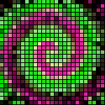{ width="300" } | ▦ | 🎨 | **Rotation Speed:** Spin velocity   **Particle Speed:** Radial velocity   **Arms:** Spiral count   **Flip:** Direction swap frequency   **Nozzle:** Emission spread   **Smear:** Full blur   **Direction:** left/right rotation   **Random Flip:** Randomize flip intervals |
| 191 | **PS Fuzzy Noise** | Organic flowing noise-based particle field.   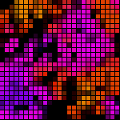{ width="300" } | ▦ | 🎨 | **Speed:** Noise change speed   **Particles:** Particle count   **Bounce:** Particle hardness   **Friction:** Movement drag   **Scale:** Noise field size   **Cylinder:** Wrap left & right   **Smear:** Full blur   **Collide:** Enable particle-particle collisions |
| 192 | **PS Ballpit** | Falling / bouncing balls simulation.   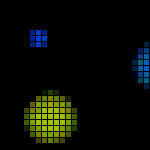{ width="300" } | ▦ | 🎨 | **Speed:** Fall speed   **Intensity:** Ball count   **Size:** Ball size, max = random  **Hardness:** Ball hardness, sticky if very low   **Saturation:** Color saturation   **Cylinder:** Wrap left & right   **Walls:** Side boundaries   **Ground:** Bottom floor |
| 193 | **PS Box** | Chaotic particles in a box.   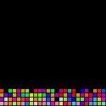{ width="300" } | ▦ | 🎨 | **Speed:** Direction change rate   **Particles:** Count   **Tilt:** Force strength   **Hardness:** Bounce hardness   **Size:** Particle size, max = random   **Random:** Random force instead of circular   **Washing Machine:** Spin back and forth   **Sloshing:** Rock my boat |
| 194 | **PS Attractor** | Particles swirling around a black hole.   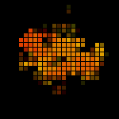{ width="300" } | ▦ ♫ | 🎨 | **Mass:** Pull-in strength   **Particles:** Count   **Size:** Particle size   **Collide:** Enable particle-particle collisions   **Friction:** Drag   **AgeColor:** Color by particle age   **Move:** Move the black hole   **Swallow:** Particles disappear when too close |
| 195 | **PS Impact** | Colorful meteor shower.   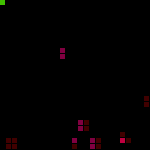{ width="300" } | ▦ | 🎨 | **Launches:** Meteor launch frequency   **Intensity:** Splash size   **Force:** Impact power   **Hardness:** Bounce hardness   **Blur:** Motion blur   **Cylinder:**  Wrap left & right   **Walls:** Side collision   **Collide:** Enable particle-particle collisions |
| 196 | **PS Waterfall** | Flowing waterfall simulation.   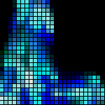{ width="300" } | ▦ | 🎨 | **Speed:** Flow velocity   **Intensity:** Water density   **Variation:** Flow randomness   **Collide:** Enable particle-particle collisions   **Position:** Waterfall position left/right   **Cylinder:**  Wrap left & right   **Walls:** Side collision   **Ground:** Splash floor |
| 197 | **PS Spray** | Directional particle spray.   { width="300" } | ▦ ♫ | 🎨 | **Speed:** Emit velocity   **Intensity:** Emit amount   **Left/Right:** Spray position   **Up/Down:** Spray position   **Angle:** Emit angle   **Gravity:** Force   **Cylinder/Square:** wrap or bounce left & right   **Collide:** Enable particle-particle collisions |
| 198 | **PS GEQ 2D** | Particle based audio-reactive equalizer.   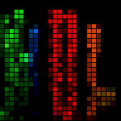{ width="300" } | ▦ ♫ | 🎨 | **Speed:** Shoot up speed   **Intensity:** Emit amount   **Diverge:** Spray spread   **Bounce:** Ground bounce   **Gravity:** Pull down force   **Cylinder:** Wrap left & right   **Walls:** Side collision   **Floor:** Enable Floor |
| 199 | **PS GEQ Nova** | Radial / Rotating audio-reactive equalizer.   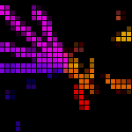{ width="300" } | ▦ ♫ | 🎨 | **Speed:** Emit speed   **Intensity:** Emit amount   **Rotation Speed:** Spin   **Color Change:** Hue shift speed   **Nozzle:** Divergence rate   **Direction:** Spin direction |
| 200 | **PS Ghost Rider** | Spiraling trail effect like the original with more options.   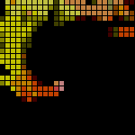{ width="300" } | ▦ | 🎨 | **Speed:** Travel velocity   **Spiral:** Path curl rate   **Blur:** Motion blur amount   **Color Cycle:** Hue shift rate   **Spread:** Trail divergence   **AgeColor:** Color by particle age   **Walls:** Bounce on boundaries |
| 201 | **PS Blobs** | Blobs moving around randomly.   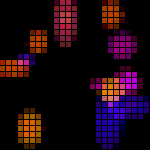{ width="300" } | ▦ ♫ | 🎨 | **Speed:** Movement velocity   **Blobs:** Blob count   **Size:** Radius   **Life:** Respawn interval   **Blur:** Motion blur   **Wobble:** Cycle shape   **Collide:** Enable collisions   **Pulsate:** Cycle size |
| 217 | **PS Galaxy** | Rotating galaxy-style star field with "hyper speed" option.   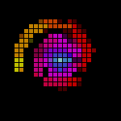{ width="300" } | ▦ | 🎨 | **Speed:** Star speed   **Intensity:** Emit amount   **Size:** Star size   **Color:** Color shift speed   **Starfield:** Hyper Speed   **Trace:** Motion blur |
| 202 | **PS DripDrop** | Dripping liquid particle effect, combines the classic "Drip" and "Rain" effects with many additional options   { width="300" } | ⋮ | 🎨 | **Speed:** Fall speed   **Intensity:** Drop frequency   **Splash:** Splash size   **Blur:** Motion blur   **Gravity:** Pull down force   **Rain:** Rain mode   **PushSplash:** Collisions on splash   **Smooth:** 2-pixel interpolation |
| 203 | **PS Pinball** | Pinball-style bouncing particles.   { width="300" } | ⋮ | 🎨 | **Speed:** Shoot speed   **Bounce:** Ball hardness   **Size:** Ball size   **Blur:** Trail length   **Gravity:** Pull down force   **Collide:** Enable collisions   **Rolling:** Rolling Balls style   **Position Color:** Color by position |
| 204 | **PS Dancing Shadows** | Shadows rushing accross the strip.   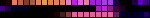{ width="300" } | ⋮ | 🎨 | **Speed:** Movement speed   **Intensity:** Number of ghosts   **Blur:** Motion blurring   **Color Cycle:** Hue shift   **Smear:** Maximum blur   **Position Color:** Color by position   **Smooth:** 2-pixel interpolation |
| 205 | **PS Fireworks 1D** | One-dimensional fireworks effect.   { width="300" } | ⋮ | 🎨 | **Gravity:** Pull down speed   **Explosion:** Blast size   **Firing side:** Starting point prefrence   **Blur:** Motion blur   **Color:** 0-15: desaturated, 16-23: full color, 24-30: color by speed, max: color by age or color by position, depending on "colorful" check   **Colorful:** Random color (may override color slider)   **Trail:** Exhaust trail   **Smooth:** 2-pixel interpolation |
| 206 | **PS Sparkler** | Versatile sparkler effect.   { width="300" } | ⋮ | 🎨 | **Move:** Emitter speed   **Intensity:** Fade speed  **Saturation:** Color saturation   **Blur:** Motion blur   **Sparklers:** Sparkle emitter count   **Slide:** Moving sparks   **Bounce:** Edge bounce   **Large:** Large size sparks |
| 207 | **PS Hourglass** | Particles falling like sand in an hourglass.   { width="300" } | ⋮ | 🎨 | **Interval:** Drop interval in 1/10s (10=1s, 20=2s)   **Density:** Particle count   **Color:** set one of the 8 color modes:   0-31: fixed color from palette  32-63: single color  64-95: bi-colored  96-127: tri-colored  128-159: gradient  160-191: multi gradient  192-223: moving gradient  224-255: color by position   **Blur:** Motion blur   **Gravity:** Fall speed   **Colorflip:** Flip color when falling   **Start:** Auto start (pause if unchecked)   **Fast Reset:** Move to initial position fast |
| 208 | **PS Spray 1D** | Spray emitter: choose your settings.   { width="300" } | ⋮ | 🎨 | **Speed(+/-):** Emit velocity (upd/down)   **Intensity:** Emit amount   **Position:** Spray position   **Blur:** Motion blur   **Gravity(+/-):** Pull force direction   **AgeColor:** Color by age   **Bounce:** Edge bounce   **Position Color:** Color by position |
| 209 | **PS 1D Balance** | Particles flowing back and forth as if the LEDs were reacting to tilt.   { width="300" } | ⋮ | 🎨 | **Speed:** Tilt speed   **Intensity:** Number of Particles   **Hardness:** Collision hardness   **Blur:** Motion blur   **Tilt:** Tilt strength   **Position Color:** Color by position   **Wrap:** Loop edges   **Random:** Randomize tilt |
| 210 | **PS Chase** | Particles chasing along the strip in a regular pattern.   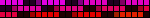{ width="300" } | ⋮ | 🎨 | **Speed:** Velocity   **Density:** Spacing   **Size:** Particle width   **Hue:** Color interval, max = random   **Blur:** Motion blur   **Playful:** Changes hue, size, speed and density over time   **Position Color:** Color by position |
| 211 | **PS Starburst** | Exploding starburst particles.   { width="300" } | ⋮ | 🎨 | **Chance:** Blast frequency   **Fragments:** Number of star fragments   **Size:** Fragment size   **Blur:** Motion blur   **Cooling:** Fade time   **Gravity:** Pull fragments down   **Colorful:** Random colors   **Push:** Enable collisions |
| 212 | **PS GEQ 1D** | One-dimensional audio equalizer.   { width="300" } | ⋮ ♫ | 🎨 | **Speed:** Particle speed   **Intensity:** Particle count   **Size:** Particle size   **Blur:** Motion blur |
| 213 | **PS Fire 1D** | One-dimensional particle fire effect.   { width="300" } | ⋮ | 🎨 | **Speed:** Flame velocity   **Intensity:** Heat level   **Cooling:** Heat dissipation   **Blur:** Motion blur |
| 214 | **PS Sonic Stream** | Flowing audio-reactive stream.   { width="300" } | ⋮ ♫ | 🎨 | **Speed:** Flow speed   **Intensity:** Emit amount and sensitivity   **Color:** Hue increment, min=white, max=color by position   **Blur:** Motion blur   **Bin:** Frequency to react to   **Mod:** Color modulation (mid frequencies)   **Filter:** Audio filtering   **Push:** Push instead of flow |
| 215 | **PS Sonic Boom** | Audio triggered particle bursts.   { width="300" } | ⋮ ♫ | 🎨 | **Speed:** Expansion speed   **Intensity:** Boom size   **Color:** Hue increment, min=white, max=color by position   **Position:** Below mid level: fixed position, above: advance per beat, max=random   **Bin:** Frequency to react to   **Mod:** Color modulation (mid frequencies)   **Filter:** Audio filtering   **Blur:** Motion blur |
| 216 | **PS Springy** | Particles connected by springs.   { width="300" } | ⋮ | 🎨 | **Stiffness:** Spring tension   **Damping:** Dampen oscillations   **Density:** Particle count   **Hue:** Color gradient, 0=color by density   **Mode:** Excitation:   Pulse: 0-5 apply at start, 6-10 apply at center   Wave: 11-20 apply at start, 21-30 apply at center  >30 apply random pulse  **Smear:** Full blur   **XL:** Large particles   **AR:** Audio reactive mode |
| 161 | **Shimmer** | A shimmer moving accross the strip with optional modulators.   { width="300" } | ⋮ | 🎨 | **Speed:** Movement speed   **Interval:** Pause time   **Size:** Width   **Granular:** Granularity size   **Flow:** Granularity movement   **Zebra:** Regular stripes   **Reverse:** Invert direction   **Sporadic:** Randomize intervals |
| 218 | **Color Clouds** | Soft and slow evolving color cloud effect.   { width="300" } | ⋮ | 🎨 | **Speed:** Cloud movement   **Intensity:** Color change speed   **Clouds:** Number of clouds   **Colors:** Color variation   **Distance:** Cloud spacing   **Cozy:** Calmer clouds |
| 219 | **Slow Transition** | Very slow transitions up to 255 minutes   { width="300" } | ⋮ | 🎨 | **Time (min):** Transition time in minutes   **Sweep:** Sweeping color change    **Exmple:** Create a preset with "Solid" FX and the starting color. Create a second preset with this FX and the end color/palette, set the fade time to 10. Create a playlist of these two presets: "Solid" preset 1s duration, set "Slow Transition" preset as end preset. |
| 151 | **PacMan** | Pixel based Pac-Man.   { width="300" } | ⋮ |  | **Speed:** Effect speed   **# of PowerDots:** Power-up dot density   **Blink distance:** Ghost start blinking distance   **Blur:** Blurring   **# of Ghost:** Number of ghosts   **Dots:** Enable dots   **Smear:** Persistant tails   **Compact** Narrow dots |

### Retired Effects

Some effects get retired when they can be recreated with newer, more general effects.

| Removed Effect  | Replacement                           | Retired After |
|-----------------|---------------------------------------|---------------|
| Candy Cane      | Chase 2 - red/white                   | 0.14.0        |
| Dissolve Rnd    | Dissolve                              | 0.14.0        |
| Dynamic Smooth  | Dynamic                               | 0.14.0        |
| Halloween       | Chase 2                               | 0.14.0        |
| Merry Christmas | Chase 2 - red/green                   | 0.12.0        |    
| Police          | Two Dot                               | 0.14.0        |
| Police All      | Two Dots - red/blue w/ full intensity | 0.13.0        |
| Two Areas       | Two Dots - full intensity             | 0.13.0        |

