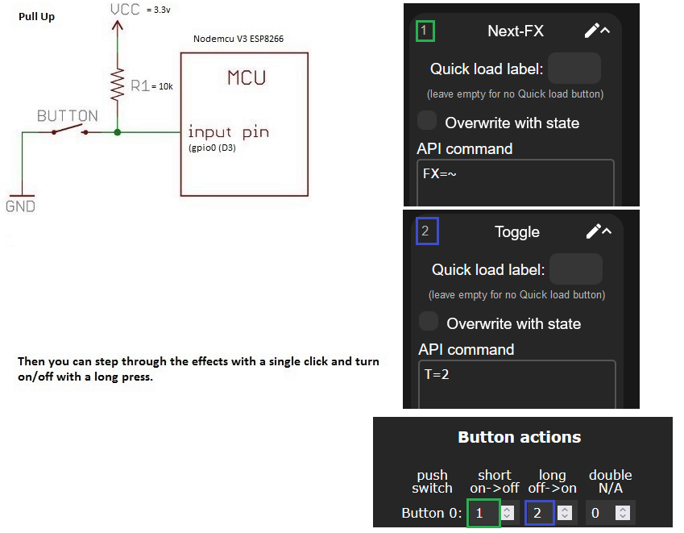

## Macro Presets

A macro is a [preset](/features/presets) that contains an HTTP API command or a JSON API command.

A macro preset does not save the current segments, colors, effects, or brightness. Instead, it runs the API command stored in the preset.

To create a macro preset:

1. Open the Presets menu.
2. Select **Create Preset**.
3. Disable **Use current state**.
4. Enter an API command.
5. Save the preset.
6. Note the preset ID.

WLED supports up to 250 presets. Use the preset ID to assign a macro preset to an event.

For API command syntax and examples, see [Presets](/features/presets), [HTTP API](/interfaces/http-api), and [JSON API](/interfaces/json-api).

!!! info
    A preset can either save a light configuration or contain an API command. Use an API-command preset when you want the preset to act as a macro.

## Assign Macro Presets

Open **Config** > **Time & Macros**. The **Macro Presets** section assigns a preset to an event.

Use preset ID `0` to use the default action instead of a preset:

* Button 0 default actions: short press toggles power; long press selects a random color.
* Default actions for all other buttons: short press changes the effect; long press adjusts brightness; double press changes the palette.

### Button Actions

You can assign presets to configured button actions.

| Button Type | Available Actions |
| --- | --- |
| Pushbutton, inverted pushbutton, touch button, or PIR sensor | Short press, long press, and double press |
| Switch or touch switch | On to Off and Off to On |
| Analog button | Analog function only |

Configure the button GPIO pin and button type in **Config** > **LED Preferences**. Then select the preset ID in **Time & Macros** > **Macro Presets** > **Button Action Presets**.

For button wiring, button types, and analog-button configuration, see [Buttons](#buttons).

### Timer and Alexa Actions

You can assign a preset to these events:

| Event | Action |
| --- | --- |
| Countdown reaches its goal | Run the **Countdown-Over Preset** |
| Timed light duration ends | Run the **Timed-Light-Over Preset** |
| Alexa turns WLED on | Run the Alexa On preset |
| Alexa turns WLED off | Run the Alexa Off preset |

Set these preset IDs in **Time & Macros** > **Macro Presets** > **Timer & Alexa Presets**.

### Time-Controlled Actions

You can schedule a preset at a regular time, sunrise, or sunset.

1. Create the preset that you want to run.
2. Open **Config** > **Time & Macros**.
3. In **Time-Controlled Presets**, add or edit a timer.
4. Select **Regular**, **Sunrise**, or **Sunset**.
5. Select the preset.
6. Set the required time, offset, days, and date range.
7. Save the settings.

For regular schedules, WLED runs the preset at the start of the selected minute.

For sunrise and sunset schedules, set the device location in **Time & Macros**. The minute value is an offset from sunrise or sunset. You can set an offset from -120 to +120 minutes.

For detailed schedule setup, see [Applying Presets at a Certain Time of Day](/features/presets#applying-presets-at-a-certain-time-of-day) and [Applying Presets at Sunrise and Sunset](/features/presets#applying-presets-at-sunrise-and-sunset).

## Buttons

A button can run a macro preset or the default action.

Configure the GPIO pin and button type in **Config** > **LED Preferences**. Then assign the preset IDs in **Config** > **Time & Macros** > **Macro Presets**.

The following button types are supported:

* Momentary pushbuttons that connect a GPIO pin to GND when pressed (normally open, active-low).
* Inverted pushbuttons that disconnect a GPIO pin from GND when pressed (inverted, active-high).
* Switches (be careful with selection of GPIO for switch since some GPIOs will prevent successful boot of ESP if held LOW or HIGH at boot).
* PIR motion sensors (they set GPIO HIGH when motion is detected, this type of buttons will also trigger MQTT message with /motion topic if "Publish on button press" is set on MQTT config).
* Touch buttons on supported ESP32 GPIO pins.
* Analog buttons, including potentiometers and analog-input buttons.

!!! warning
    Some GPIO pins can prevent the ESP from booting when they are held LOW or HIGH. Check the hardware requirements for your board before you use a GPIO pin as a switch input.

For a momentary button, WLED detects the action _after you release_ the button. This delay lets WLED distinguish short, long, and double presses.

Set the same preset for short, long, and double press to run that preset _directly_ when the button is pressed.

Button 0 has two built-in functions:

* Hold for more than 5 seconds to open the WLED-AP access point (default password `wled1234`).
* Hold for more than 10 seconds to erase flash memory and perform a factory reset.

### Example

The simplest macro preset example is getting a button to do your bidding.  

The default pin to which a button can be connected is GPIO 0 (D3 on NodeMCU, D1 Mini and others).  Even though WLED uses the internal pull up resistors on input pins, this pin is ideally externally pulled high to 3.3V with a 10k resistor. The configured macro executes when the pin is pulled low (grounded).

The desired macro preset is created, and then assigned to a short, long or double press on the Time & Macros configuration page.

Like this:

The "T=2" macro toggles power to the LEDs (in this case long press).
The "FX=~" macro steps through the effects (in this case short press).

You can set a preset to `P1=1&P2=3&PL=~`, enter the preset number for your button, and this will step through presets 1 and 3. Change the "3" to whatever your highest preset is that you want to include.

## Analog Button

An analog button does not run a preset. It controls one analog function.

Set the **Short** and **Long** actions to `0`. Then set the **Double** action to one of these values:

| Property | Value |
| --- | --- |
| Global brightness | 250 |
| Effect speed | 249 |
| Effect intensity | 248 |
| Palette | 247 |
| Primary color hue | 200 |
| Segment N opacity | 0-32 |

Connect the potentiometer to 3.3 V and GND. Connect its output to A0, or to the ADC pin that you configure. Use a potentiometer of 10 kΩ or greater.

!!! info "Do Not Use ESP32 ADC2 GPIO Pins for Analog Buttons"
    On ESP8266, you can only have a single analog button on pin A0, the pin set in the settings UI is ignored.  
    On ESP32, only ADC1 pins will work for analog input while WiFi is active (pins 32-39). ADC2 pins will not work.

#### Global Brightness

WLED turns the LEDs off when the global-brightness potentiometer reaches either extreme.

To prevent switch-off at maximum brightness, add a resistor between the potentiometer and 3.3 V. Use a value of approximately 7.5% to 10% of the potentiometer resistance. For a 10 kΩ potentiometer, use approximately 750 Ω.

To prevent switch-off at minimum brightness, add a resistor between the potentiometer and GND. Use a value of approximately 3% to 5% of the potentiometer resistance. For a 10 kΩ potentiometer, use approximately 500 Ω.

These resistors reduce the available adjustment range. Test the circuit and adjust the resistor values for stable operation.
